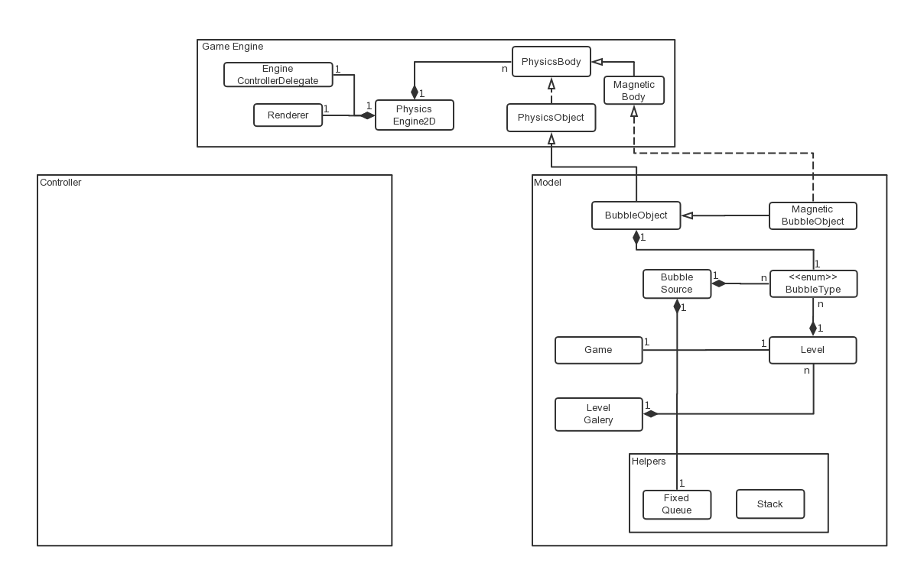

# Bubble Hero

This is an iOS game similar to Bubble Blast Saga, built with Swift 4 and latest API from iOS 11. It was built by [Yunpeng](https://yunpengn.github.io/) in 2018.

    

## Rules of the Game

1. Make sure you have uninstalled all previous (or older) versions of _Bubble Hero_.
2. Install and open the game, you should see `Start`, `Design`, `Settings` and `About` four buttons.
3. `Start` button will lead to the level selection screen, `Design` will lead to the level designer screen, both of which will be discussed in details as follows.

##### Level Designer
1. You can select all different types of bubbles from the palette to fill the bubble grid. They include 4 basic types (blue, green, yellow & red) and 5 special types (indestructible, lightning, bomb, star & magnetic). You can also use the eraser to erase filled bubbles.
2. `Back` button will lead you back to the main menu screen.
3. `Start` button will start a new game with the current design (but will not save the design).
4. `Save` button will allow you to save the current design (and thus can be used later). The name of the level design can only include alphanumeric characters (both upper-size and lower-case). It cannot be empty or the same as any previous design that has been saved.
5. `Load` button will lead to the level selection screen, in which you can select a previously-saved design and continue your design based on it. Long-press will delete a previously-saved design.
6. `Reset` will clear all bubbles in the current design, which is irreversible. You need to confirm this action.

##### Level Selection
1. You can single-tap to select any level, long-press to delete any level.
2. If you come from level designer, it will go back to level designer screen after single-tap; if you come from menu screen, it will start a new game after single-tap.
3. If you come from menu screen, the last item in level gallery will be marked with a question mark, which denotes it is a random level design automatically generated. You can select it to start a game for fun. This random design cannot be deleted.
4. When you open the game for the first time, three levels will be pre-loaded for you. You can design more levels on your own.

##### Game Play
1. Each game has a time limit of 90 seconds. The ultimate goal is to earn more points. Removing more bubbles does not necessarily mean higher score. We appreciate your wisdom.
2. The cannon below will be used to shoot bubbles. You should drag (rather than single-tap) to launch bubbles. The cannon will face towards the direction of your finger.
3. The two bubbles at the right bottom of the screen shows the next & next second bubbles to be launched, which can be a useful hint.
4. The time at the left bottom of the screen shows the time left. You cannot shoot bubbles anymore when time is up.
5. The cannon will launch only basic-type (blue, green, yellow & red) bubbles (either snapping or non-snapping).
6. You can only launch the next bubble after the current bubble stops.
7. If no special effect is triggered, same-color bubbles will be removed only if they form a connected group of at least 3.
8. Hanging bubbles (not attached to the top wall, either directly or indirectly) will always be removed.
9. If any launched bubble touches a bomb bubble, the bubbles around the bomb will be removed and you should hear an explosion sound effect. The bomb itself will also be removed. _Notice that sometimes you may feel a non-snapping bubble "around" the bomb is not removed, this is because there exists some space between the non-snapping bubble and the bomb (which may be invisible)._
10. If any launched bubble touches a lightning bubble, any bubble on the same row as the lightning bubble will be removed and you should hear a thunder sound effect. The lightning bubble itself will also be removed. _Notice that most likely non-snapping bubbles cannot be removed by a lightning bubble, because their height is not an integer multiple of the standard height value._
11. If any launched bubble touches a star bubble, any bubble with the same color as the launched bubble will be removed. The star bubble itself will also be removed.
12. Indestructible bubbles and magnetic bubbles can only be removed by special effects or by falling.
13. Magnetic bubbles will attract the launched bubbles, whose force is inverse proportional to the square of the distance between them.
14. Special bubbles allow chaining effect. On the one hand, any special bubble itself removed by the special effect of another special bubble will be triggered; on the other hand, the same-type neighbors of a special bubble being triggered will also be triggered.
15. Bubbles with a purple border are non-snapping ones. They will not snap to the standard cells. Instead, they will stop immediately after they touch any other bubbles. However, they are also normal color bubbles. They can also be removed when forming a connected same-color group of at least 3. Any later launched bubbles which touch it will also become non-snapping.
16. The score is calculated according to the reason a bubble is removed: same-color - 5 points, star - 10 points, lightning - 12 points, bomb - 15 points, falling - 8 points.

## Class Diagram

## Acknowledgements

We would like appreciate the wonderful resources provided by the following websites:
- Pexels [https://www.pexels.com]
- Flat Icons [https://www.flaticon.com]
- Sound Bible [http://soundbible.com]
- Free Music Archive [http://freemusicarchive.org]

## Licence

[GNU General Public Licence 3.0](LICENSE)
